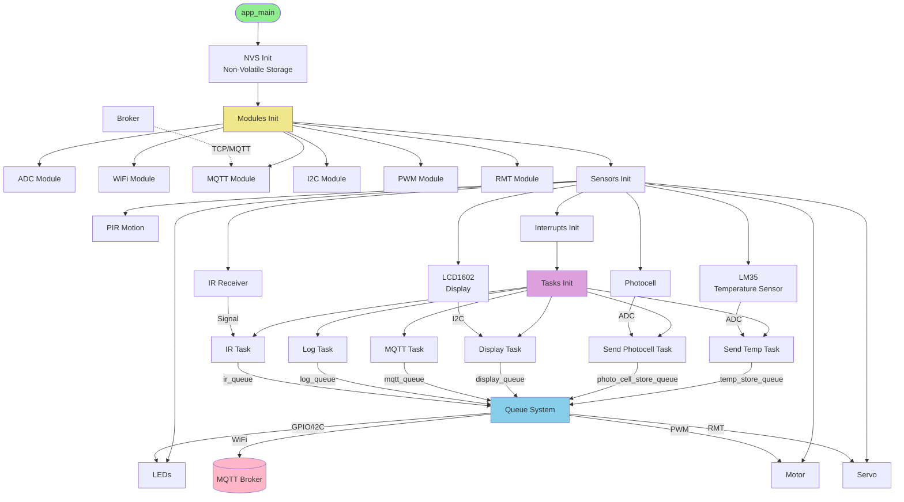
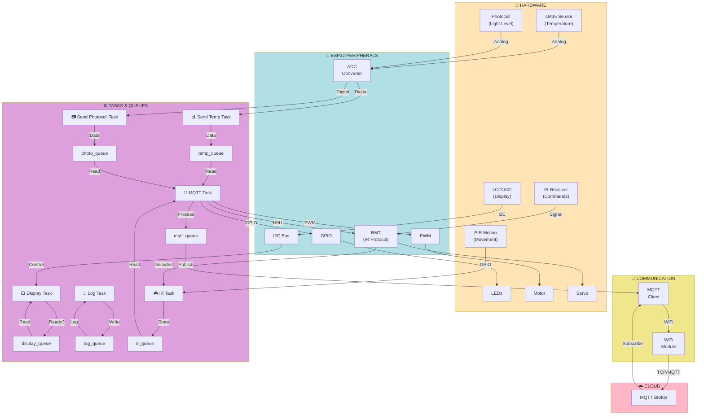

# SmartHome ESP32 - System Architecture

## 1. System Initialization

Sequence diagram showing the initialization of all components at startup:



## 2. Data Flow

Diagram showing data movement between sensors, tasks, queues, and cloud:



## Components Description

### 🔌 Hardware
- **LM35** - Temperature sensor, connected to ADC
- **Photocell** - Light level sensor, connected to ADC
- **PIR Motion** - Motion detector, connected to GPIO
- **IR Receiver** - Infrared signal receiver
- **LCD1602** - Display (2x16 characters), connected via I2C
- **LEDs** - Indicator LEDs
- **Motor** - DC motor, controlled by PWM
- **Servo** - Servo motor, controlled by RMT

### 🔗 ESP32 Peripherals
- **ADC** - Analog-to-digital converter (12-bit)
- **I2C Bus** - I²C bus for display communication
- **PWM** - Pulse-width modulation for motor control
- **RMT** - Remote Control Transceiver for IR and servo
- **GPIO** - General-purpose digital inputs/outputs

### ⚙️ FreeRTOS Tasks
- **Send Temp Task** - Reads temperature sensor and sends to queue
- **Send Photocell Task** - Reads light level and sends to queue
- **Display Task** - Controls display (information output)
- **MQTT Task** - Main processing task, publishes data to cloud and processes commands
- **Log Task** - Event logging
- **IR Task** - IR command processing and device control

### 📡 Communication
- **WiFi** - Home network WiFi connectivity
- **MQTT** - Message exchange protocol (cloud)
- **MQTT Broker** - Cloud server for message storage

### 💾 Storage
- **NVS** - Non-volatile storage (flash memory) for configuration and WiFi/MQTT credentials

## Execution Flow

1. **Initialization**: `app_main()` calls initialization functions in sequence
2. **Parallel Startup**: All tasks are launched and run simultaneously via FreeRTOS scheduler
3. **Data Collection**: Each task collects data from its sensors
4. **Queues**: Tasks use queues for safe data transmission between threads
5. **Cloud Processing**: MQTT Task reads from all queues and publishes data to MQTT Broker
6. **Device Control**: Commands from cloud update actuator states (motor, LEDs, servo)

## FreeRTOS Queues

```
temp_store_queue       → temperature data
photo_cell_store_queue → light level
display_queue          → display commands
ir_queue               → IR remote commands
mqtt_queue             → commands from cloud
log_queue              → event logging
```

All queues converge in MQTT Task, which coordinates all system activities.
