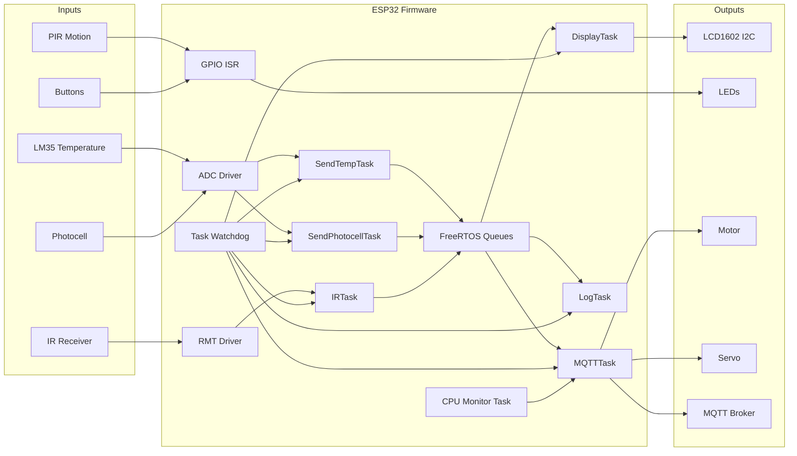

# SmartHome ESP32 - Block Diagram

This file provides a compact block diagram for project review and defense.

## Functional Block Diagram

## Notes

- Data flow: `LM35/Photocell -> ADC -> SendTempTask/SendPhotocellTask -> MQTT Task -> Cloud Broker`
- Manual control: IR remote commands and GPIO buttons trigger actions via GPIO ISR
- Reliability: Watchdog is initialized with idempotent error handling and serviced in all active tasks (IR task uses 4s timeout)
- Asynchronous architecture: Sensor and control data exchanged through FreeRTOS queues
- Sensor data buffer: Fixed `key[32]` to safely hold topic strings like `sensor/temperature`
